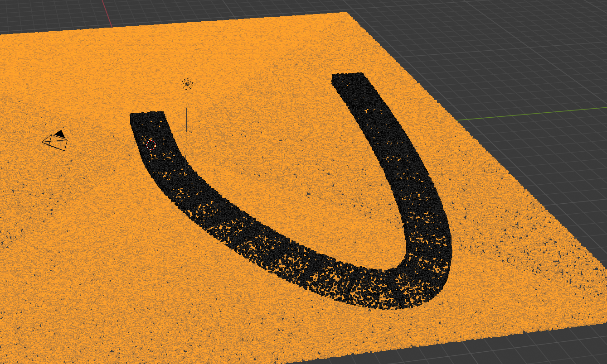
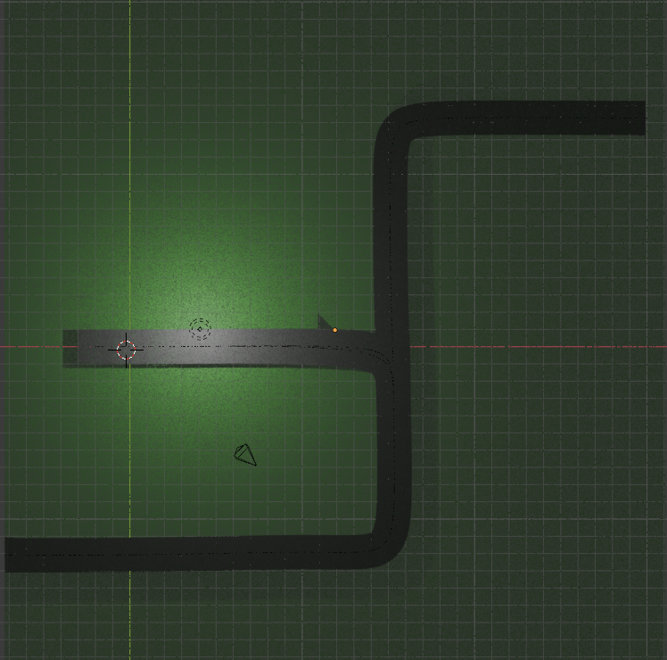
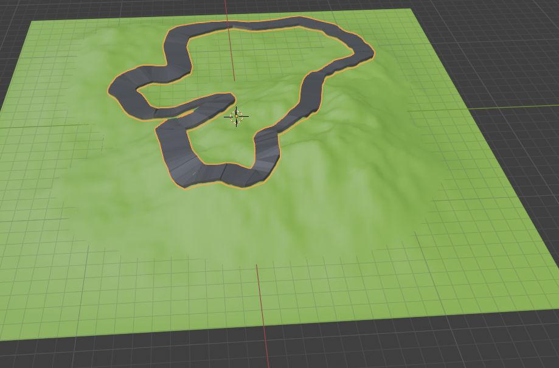

# Road segmentation/classification challenge
Given a set of point cloud, identify the roads and draw an ideal line segment. The closer the segment is to running through the middle of the road, the better the score.

## What you will get out of this challenge
- A better understanding of the challenges of road segmentation in point clouds and working with 3D data
- Exposure to a variety of algorithms for point cloud processing
- Experience with popular libraries such as Open3D and NumPy
- Making trade offs and choosing algorithms based on the problem at hand
- Learning about the importance of data, features, collaboration and optimization

The goal isn't to get a perfect score, but to get a feel for the challenges and trade offs involved and to critically think about the different approaches to solving the problem.

Example cases you may need to solve for:







A Google drive location will be provided on the day of the challenge. Come up with a team name and submit your solution as `team_name.zip`. It should include a `solution.md` on: 

- a link to your forked repository
- algorithms you tried and why you chose the one you did and the pros and cons of the algorithms
- how you tuned your hyperparameters, if any
- trade offs you made
- what you would do if you had more time, data, compute power (be specific)

It should also include json file of your solution that was generated with the `Solution` class found in `model/solution.py`. 

To create a Solution, instantiate the `Solution()` class.
Then for each problem you solve in `/data`, add it to your set of solutions with the `add_solution()` method. 

Make sure the problem name matches the filename in the data folder. For each problem, there should be an array of `LineSegment`s that you have classified as roads. 

Example usage:
```python
basic_lines: list[LineSegment] = solve(...) # returns a list of LineSegments
bendy_lines: list[LineSegment] = solve(...)

solution = Solution(output_file="solutions.json")
solution.add_solution(name="basic.ply", lines=basic_lines)
solution.add_solution(name="bendy.ply", lines=bendy_lines)
solution.to_json() # generates solutions.json for submission
```

## TODOs
- [x] point cloud reader util
- [x] point cloud reduction util
- [ ] more details here on scoring, where to implement and example data.
- [ ] maybe convert to a similarity score instead of a distance
- [ ] visually display ideal and actual segments and their scores
- [ ] automated evaluator

## Requirements
- Python ~3.10
- [Poetry](https://python-poetry.org/)
- [Git LFS](https://git-lfs.com/)
- Tested on Intel and ARM based Macs
- 32GB+ of RAM highly recommended. You could get away with 16GB but you'll have to be stricter with your algorithms

Set poetry configs:
```bash
poetry config virtualenvs.in-project true
```

## Suggested reading
[PLY file format](https://paulbourke.net/dataformats/ply/)

Note that we synthetically generated the point cloud. So each point in the point cloud file has more properties than it needs which is why you'll see some RGBa values as 0's and others are filled out. i.e. Road type points may have `road_colour` populated but not `ground_colour`. Due to the way the synthetic data was generated, the properties had to be on the same line. It is not recommended that you rely on these properties for all datasets.

## Quickstart
If your Python environment manager doesn't conflict with Poetry, you should have a `.venv` in this project folder. If not, it's probably somewhere else and you should check with `poetry env info` and set your IDE's python interpreter to that. In VSCode that's with `cmd/ctrl + SHIFT + p` -> "Python: Select Interpreter" -> <path to your interpreter from the previous command>

```bash
poetry install
poetry run jupyter lab
```
Jupyter lab should pop up in your browser and you can select `Main.ipynb` to start trying things out. The built in Jupyter notebook interpreter in VSCode also works. There's a known issue on MacOS where the window may still freeze even after you push "q" to quit. That's okay, just restart the kernel.

## Running snippets
```bash
poetry run python snippets/visualize_pc.py
```

## Running tests
```bash
poetry run pytest
```

## Directory layout
- `model` - Model entities. Contains a `Point` class that you can use in your logic. Check out its properties. You'll also want the look at the `LineSegment` class as the main output.
- `snippets` - Little helpful code snippets if you want to run them individually to test stuff out, they're not part of the main app
- `util` - Various helper utilities. One creates a O3d point cloud and the other is for parsing the custom PLY file and its properties.
- `evaluators` - Scoring logic for the challenge. There's a couple of types there so you can use it for optimizing your algorithms.

## Troubleshooting
### What the heck are the visualization controls?
Taken from the [docs](https://www.open3d.org/docs/release/tutorial/visualization/visualization.html):
```text
-- Mouse view control --
  Left button + drag         : Rotate.
  Ctrl + left button + drag  : Translate.
  Wheel button + drag        : Translate.
  Shift + left button + drag : Roll.
  Wheel                      : Zoom in/out.

-- Keyboard view control --
  [/]          : Increase/decrease field of view.
  R            : Reset view point.
  Ctrl/Cmd + C : Copy current view status into the clipboard.
  Ctrl/Cmd + V : Paste view status from clipboard.

-- General control --
  Q, Esc       : Exit window.
  H            : Print help message.
  P, PrtScn    : Take a screen capture.
  D            : Take a depth capture.
  O            : Take a capture of current rendering settings.
```

### Pulling down the actual data instead of the pointers
```bash
git lfs pull
```

### Remove your poetry env manually
```bash
rm -rf `poetry env info -p`
```

### Getting the python executable path for a different IDE
Use:
```bash
poetry env info --executable
```
to get the Python environment for VSCode if the IDE can't find it by itself / you aren't using JupyterLab

### Using a different Python environment
You may want to specify a different Python environment in Poetry:
```bash
poetry env use <Path to your python version>
```

### Open3D ML dependencies
There are several dependencies added manually e.g. addict, pillow etc because they weren't published to Pypi for Poetry to grab.
If you see errors importing open3d, just `poetry add` them.


## References
- Open3d docs - https://www.open3d.org/docs/release/
- Numpy - https://numpy.org/doc/
